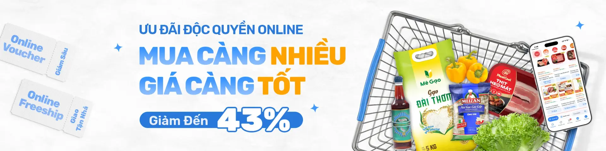

# Food E-commerce Project

<p align="center">
	
</p>

<p align="center">
	<b>Nền tảng thương mại điện tử thực phẩm sạch</b><br/>
	Xây dựng với Nuxt 4, tối ưu trải nghiệm mua sắm, hiệu năng và khả năng mở rộng.
</p>

<p align="center">
	
	
	
	
	
	
</p>

---

## 📑 Mục lục

- [🎯 Giới thiệu dự án](#-giới-thiệu-dự-án)
- [✨ Tính năng chính](#-tính-năng-chính)
- [🧱 Công nghệ sử dụng](#-công-nghệ-sử-dụng)
- [⚙️ Hướng dẫn cài đặt](#️-hướng-dẫn-cài-đặt)
- [🗂️ Cấu trúc dự án (mô tả chi tiết)](#️-cấu-trúc-dự-án-mô-tả-chi-tiết)
- [🔍 Chi tiết tính năng](#-chi-tiết-tính-năng)
- [🖼️ Hình ảnh và video minh họa](#️-hình-ảnh-và-video-minh-họa)
- [🚀 Định hướng phát triển](#-định-hướng-phát-triển)

---

## 🎯 Giới thiệu dự án

Food E-commerce là website bán thực phẩm sạch hướng đến trải nghiệm người dùng hiện đại, trực quan và đáng tin cậy.

Mục tiêu dự án:

- Cung cấp nền tảng mua sắm thực phẩm sạch dễ sử dụng.
- Tối ưu hành trình khách hàng từ duyệt sản phẩm đến đặt hàng.
- Chuẩn hóa source code để dễ bảo trì, dễ scale team.

Đối tượng sử dụng:

- Người dùng cuối mua sắm online.
- Team frontend/backend/QA trong quá trình phát triển sản phẩm.

---

## ✨ Tính năng chính

- 🏠 Trang chủ trực quan: hero banner, khu sản phẩm nổi bật, section nội dung.
- 🛍️ Danh mục sản phẩm: hiển thị theo nhóm, theo slug.
- 🔎 Tìm kiếm sản phẩm theo từ khóa và lọc dữ liệu.
- 📦 Giỏ hàng và thông tin đặt hàng cơ bản.
- 📰 Trang tin tức và bài viết chi tiết.
- 👤 Hồ sơ người dùng, xác thực và các trang auth.
- 🎫 Ví voucher và các trang chính sách/hướng dẫn.
- ⚡ Skeleton loading cho nhiều màn hình để cải thiện UX.

---

## 🧱 Công nghệ sử dụng

### Frontend Core

- Nuxt 4
- Vue 3
- Vue Router

### UI/UX

- PrimeVue 4
- PrimeIcons
- Tailwind CSS v4

### Data & State

- Pinia
- pinia-plugin-persistedstate
- Axios
- TanStack Vue Query

### Tooling

- ESLint (@nuxt/eslint)
- Google Fonts module

---

## ⚙️ Hướng dẫn cài đặt

### 1) Yêu cầu môi trường

- Node.js 20+
- npm 10+

### 2) Cài đặt project

```bash
# Clone source
git clone <repository-url>

# Vào thư mục dự án
cd food-ecommerce

# Cài dependencies
npm install
```

### 3) Cấu hình biến môi trường

Tạo file `.env` tại thư mục gốc:

```env
NUXT_PUBLIC_API_BASE_URL=http://localhost:8017
```

### 4) Chạy dự án

```bash
npm run dev
```

Mặc định chạy tại: `http://localhost:3000`

### 5) Build production

```bash
npm run build
npm run preview
```

### 6) Kiểm tra chất lượng code

```bash
npm run lint
npm run lint:fix
```

---

## 🗂️ Cấu trúc dự án (mô tả chi tiết)

```text
food-ecommerce/
|- app/
|  |- app.vue                     # Root app shell, render layout + NuxtPage
|  |
|  |- assets/                     # Ảnh, icon, css, font tĩnh dùng toàn app
|  |
|  |- components/                 # Tầng UI component (tái sử dụng + theo domain)
|  |  |- auth/                    # Component riêng cho đăng nhập/đăng ký/xác thực
|  |  |- common/                  # Component dùng chung: pagination, loading, ...
|  |  |- features/
|  |  |  |- home/                 # Component gắn với feature trang chủ
|  |  |- layout/                  # Header/Footer/Sidebar dùng cho bố cục tổng
|  |  |- pages/                   # Component theo từng nhóm trang nghiệp vụ
|  |  |  |- account/              # Trang liên quan tài khoản cá nhân
|  |  |  |- catalog/              # Danh mục và chi tiết sản phẩm
|  |  |  |- commerce/             # Luồng thương mại: giỏ hàng, mua hàng
|  |  |  |- company/              # About, Vision/Mission
|  |  |  |- content/              # News list + article detail
|  |  |  |- errors/               # NotFoundPage / SystemErrorPage (404, 5xx)
|  |  |  |- policies/             # Privacy, Terms, Return, Guide, ...
|  |  |  |- promotions/           # Voucher/khuyến mãi
|  |  |  |- search/               # UI trang tìm kiếm
|  |  |  |- support/              # Trang hỗ trợ khách hàng
|  |  |- skeletons/               # Skeleton loading theo từng màn hình
|  |
|  |- composables/                # Reusable logic (hooks kiểu Vue)
|  |- constants/                  # Hằng số hệ thống (routes, config key...)
|  |- layouts/                    # Layout pages của Nuxt (default, ...)
|  |- middleware/                 # Route guards / auth checks
|  |- mutations/                  # Các tác vụ mutate data tách theo module
|  |- pages/                      # File-based routing của Nuxt
|  |  |- index.vue                # Trang chủ
|  |  |- about.vue                # Giới thiệu doanh nghiệp
|  |  |- search.vue               # Trang tìm kiếm
|  |  |- cart.vue                 # Giỏ hàng
|  |  |- profile.vue              # Hồ sơ người dùng
|  |  |- privacy-policy.vue       # Chính sách bảo mật
|  |  |- terms-of-service.vue     # Điều khoản dịch vụ
|  |  |- shopping-guide.vue       # Hướng dẫn mua sắm
|  |  |- support.vue              # Hỗ trợ khách hàng
|  |  |- returns.vue              # Chính sách đổi trả
|  |  |- registration-guide.vue   # Hướng dẫn đăng ký
|  |  |- vision-mission.vue       # Tầm nhìn - sứ mệnh
|  |  |- vouchers.vue             # Ví voucher
|  |  |- auth/                    # Cụm route xác thực (login/register/...)
|  |  |- category/[slug].vue      # Danh mục động theo slug
|  |  |- product/[slug].vue       # Chi tiết sản phẩm động theo slug
|  |  |- news/index.vue           # Danh sách tin tức
|  |  |- news/[slug].vue          # Chi tiết bài viết
|  |  |- order/info.vue           # Thông tin đơn hàng
|  |  |- order/checkout.vue       # Thanh toán
|  |
|  |- plugins/                    # Đăng ký plugin/client instance toàn app
|  |- queries/                    # Query layer gọi API (nếu theo vue-query)
|  |- services/                   # API services theo domain
|  |- stores/                     # Pinia stores
|  |- types/                      # Định nghĩa TypeScript types/interfaces
|  |- utils/                      # Hàm tiện ích dùng chung
|  |
|  |- error.vue                   # Entry xử lý lỗi Nuxt -> map 404/system error UI
|
|- nuxt.config.ts                 # Cấu hình Nuxt, module, runtimeConfig, css
|- package.json                   # Scripts và dependency của dự án
|- README.md                      # Tài liệu dự án
```

---

## 🔍 Chi tiết tính năng

### 🏠 1) Homepage

- Hero banner với nhiều slide và hiệu ứng.
- Product section theo từng nhóm nổi bật.
- Blog/news teaser để tăng tương tác nội dung.
- Back-to-top cho trải nghiệm trang dài.

### 🧭 2) Routing và phân luồng trang

- Routing động cho category/product/news bằng slug.
- Tách route theo domain (`auth`, `order`, `news`) giúp dễ scale.
- Có lớp fallback lỗi thông qua `error.vue` + components lỗi.

### 🛒 3) Shopping flow

- Luồng xem sản phẩm -> thêm giỏ -> checkout.
- Hiển thị giá, giảm giá, tags khuyến mãi trực quan trên card.

### 🔐 4) Auth và hồ sơ

- Đăng nhập, đăng ký, quên mật khẩu, đổi mật khẩu.
- Xác thực tài khoản và màn profile cá nhân.

### 📘 5) Nội dung chính sách và hỗ trợ

- Bộ trang pháp lý và hướng dẫn đầy đủ:
  Privacy Policy, Terms of Service, Shopping Guide, Returns, Support.

### ⚡ 6) Trải nghiệm người dùng

- Skeleton loading cho các màn có dữ liệu nặng.
- Cấu trúc component theo feature/responsibility giúp dễ maintain.

---

## 🖼️ Hình ảnh và video minh họa

### 1) Thư viện ảnh hiện có

| Hạng mục      | Minh họa                                                 |
| ------------- | -------------------------------------------------------- |
| Logo chính    |                       |
| Logo phụ      |                    |
| Hero banner 1 |  |
| Hero banner 2 |  |
| Chứng nhận    |                         |

### 2) Video demo giao diện

Hiện repository chưa có video demo. Để README chuyên nghiệp hơn khi gửi nhà tuyển dụng, nên bổ sung:

- Video walkthrough 60-90 giây (home -> search -> product -> cart).
- Link YouTube public hoặc Google Drive.

Mẫu chèn:

```md
## 🎥 Demo Video

[Xem video demo giao diện](https://www.youtube.com/watch?v=YOUR_VIDEO_ID)
```

---

## 🚀 Định hướng phát triển

- Tích hợp thanh toán online đầy đủ (VNPay/MoMo/ZaloPay).
- Bổ sung quản lý đơn hàng realtime theo trạng thái vận chuyển.
- CMS nội dung cho blog/landing page marketing.
- Tăng độ phủ test: unit + integration + e2e.
- Tối ưu SEO và performance theo Core Web Vitals.

---

## 👨‍💻 Gợi ý khi gửi nhà tuyển dụng

- Đặt repo ở chế độ public kèm README như trên.
- Gắn thêm demo video ngắn và 3 ảnh screenshot màn quan trọng.
- Đưa rõ vai trò cá nhân ở mục mô tả PR hoặc phần About repo.
